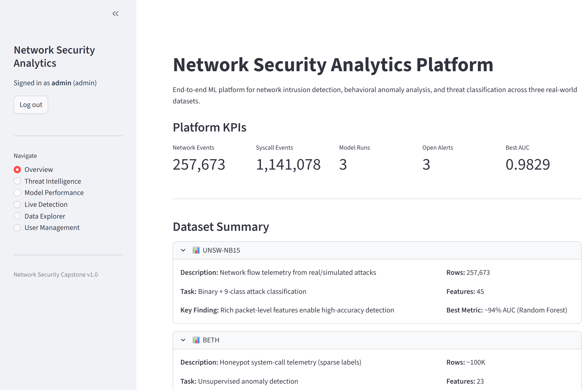
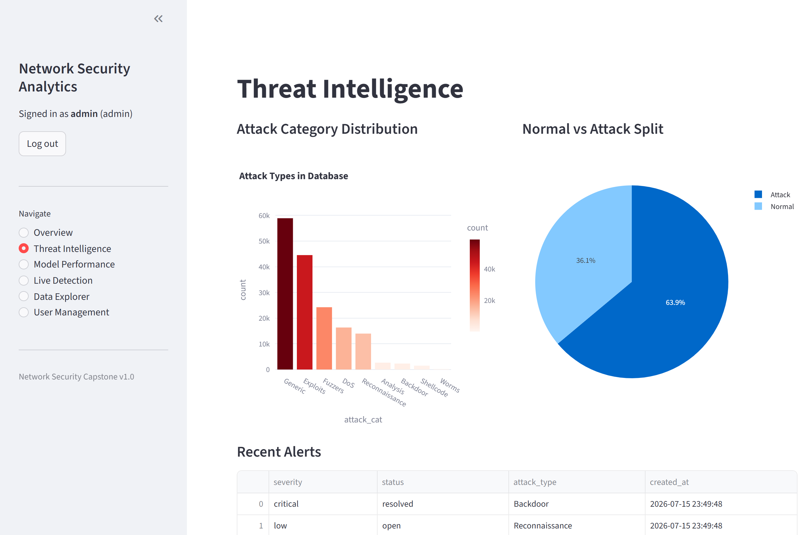
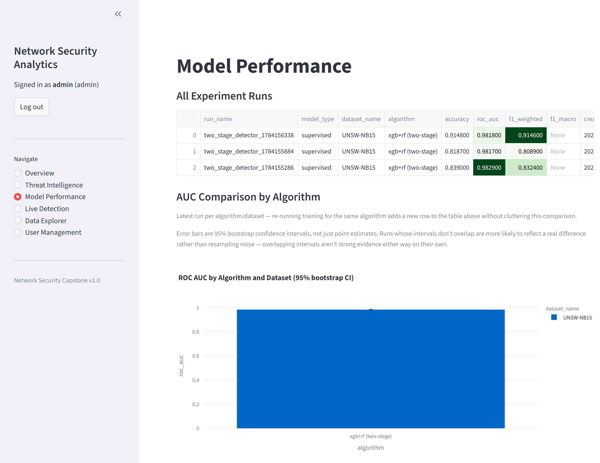
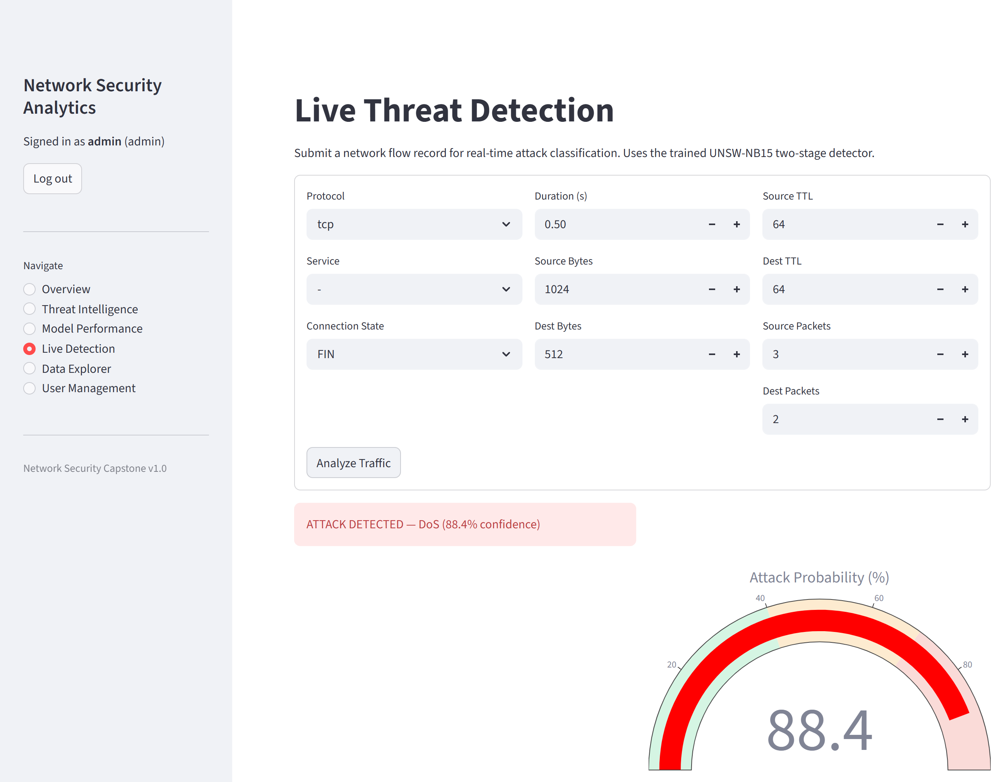
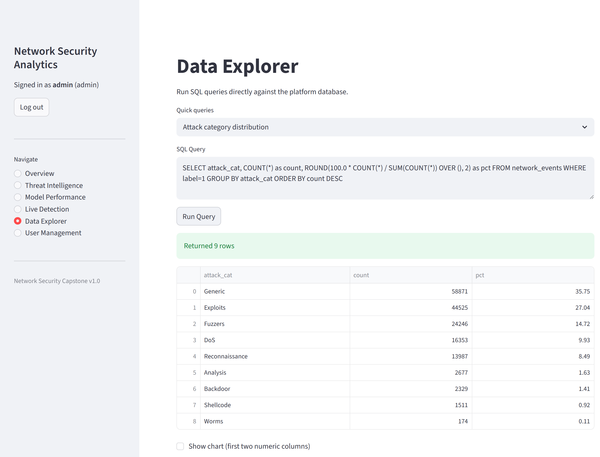
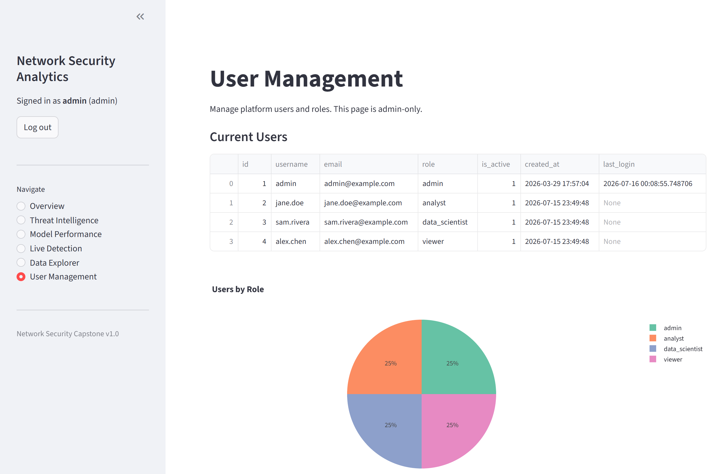

# 🛡️ Network Security Analytics Platform

> An end-to-end ML platform for network intrusion detection, behavioral anomaly analysis, and threat classification — the full data lifecycle from raw CSV ingestion through database storage, model training, a JWT-secured REST API, and an authenticated, role-gated dashboard.

Built as an MS Data Science capstone at **Boston University**, this platform intentionally spans the full stack of skills expected from a **Data Analyst**, **Data Scientist**, and **Data Engineer** — including a real security remediation pass (see [Security & Privacy](#-security--privacy) below) rather than just a modeling notebook.

---

## 🔌 Running It

Follows [Quick Start](#-quick-start) below. Once running locally:

| Service | URL |
|---------|-----|
| 📊 Streamlit Dashboard | `http://localhost:8501` |
| 🔌 FastAPI + Swagger UI | `http://localhost:8000/docs` |

No hosted demo — the ML artifacts alone are ~180MB and the datasets aren't
redistributed (see [Quick Start](#-quick-start) for sources), so this runs
locally rather than as a public deployment.

---

## 📸 Dashboard Screenshots

**Overview** — Platform KPIs against real ingested data (257K+ network events, 1.1M+ syscall events)


**Threat Intelligence** — Attack category distribution and the SOC-style alert queue


**Model Performance** — Real training runs with 95% bootstrap confidence intervals, not just point estimates


**Live Detection** — Real two-stage prediction: binary flag + attack-type classification, not a stub


**Data Explorer** — Real SQL (including a window function) against the live database, admin-only


**User Management** — Role-based access control, admin-only


---

## 🏗️ Architecture

```
Raw CSVs  →  DataLoader  →  DataValidator  →  Preprocessor
                                                    ↓
                               Supervised Models (UNSW-NB15)
                               Unsupervised Models (BETH)
                                                    ↓
                              SQLite / PostgreSQL Database
                              ┌───────────────┐
                              │  ORM Models   │  users, network_events,
                              │  (SQLAlchemy) │  system_call_events,
                              │               │  model_runs, alerts
                              └───────────────┘
                               ↙                ↘
                     FastAPI REST API      Streamlit Dashboard
                     (JWT auth,            (6 pages: overview,
                      predictions,          threats, models,
                      alert mgmt)           live detection, SQL,
                                            user management)
```

---

## 📊 Datasets

| Dataset | Type | Rows | Task | Result |
|---------|------|------|------|--------|
| **UNSW-NB15** | Real network telemetry | 257,673 | Binary + 9-class attack classification | **98.5% AUC** |
| **BETH** | Honeypot system-call logs | ~1.1M | Unsupervised anomaly detection | Silhouette = 0.38 |
| **Cyber Attacks (Synthetic)** | Synthetic attack records | 40,000 | 3-class classification | 33% accuracy — honest failure documented |

---

## 🧠 Techniques Demonstrated

### Data Engineering
- Chunked ETL ingestion with provenance tracking
- SQLAlchemy ORM with full schema (6 tables)
- Role-based user management with bcrypt-hashed passwords
- Docker Compose deployment (PostgreSQL + API + Dashboard)
- Alembic migrations support

### Data Analysis
- Exploratory data analysis with leakage detection
- SQL analytics views
- Interactive SQL query interface in dashboard

### Data Science
- Modular preprocessing pipelines — fit on train, applied to test, serializable
- **Supervised:** Two-stage IDS pipeline (detect → classify) with SMOTE, cross-validation, feature importance
- **Unsupervised:** 5-algorithm ensemble (K-Means, DBSCAN, Isolation Forest, GMM, PCA reconstruction)
- MLflow experiment tracking integration
- **Honest evaluation** — synthetic dataset reveals metadata limitations (33% = random baseline)

### ML Engineering
- FastAPI REST service with JWT authentication
- Live prediction endpoint + batch prediction (up to 1,000 records)
- Model serialization with joblib
- Pytest test suite (30+ tests)

---

## 📁 Project Structure

```
network-security-capstone/
│
├── notebooks/                     # Analysis notebooks (numbered workflow)
│   ├── 01_data_overview.ipynb
│   ├── 02_beth_unsupervised.ipynb
│   ├── 03_unsw_supervised.ipynb
│   ├── 04_cyber_attacks_supervised.ipynb
│   ├── 05_results_comparison.ipynb
│   └── 06_database_pipeline.ipynb
│
├── src/                           # Production Python package
│   ├── config.py
│   ├── data/
│   │   ├── loader.py
│   │   ├── validator.py
│   │   └── preprocessor.py
│   ├── models/
│   │   ├── supervised.py          # TwoStageDetector, AttackClassifier
│   │   └── unsupervised.py        # AnomalyDetector (5 algorithms)
│   ├── db/
│   │   ├── models.py              # SQLAlchemy ORM
│   │   ├── connector.py           # DB connection + user management
│   │   └── ingest.py              # ETL ingestion
│   └── api/
│       └── app.py                 # FastAPI service
│
├── dashboard/
│   └── app.py                     # Streamlit 6-page dashboard
│
├── tests/                         # Pytest test suite
├── configs/                       # YAML configuration files
├── docker-compose.yml             # PostgreSQL + API + Dashboard
├── Dockerfile
├── requirements.txt
└── .env.example
```

---

## ⚡ Quick Start

### Option A — Local (SQLite, no Docker needed)

```bash
# 1. Clone the repo
git clone https://github.com/Kevin-Egemba/network-security-capstone.git
cd network-security-capstone

# 2. Create virtual environment (Python 3.11 required)
py -3.11 -m venv venv
source venv/bin/activate  # Windows: .\venv\Scripts\activate

# 3. Install dependencies
pip install -r requirements.txt

# 4. Set up environment
cp .env.example .env
# Edit .env: set DATABASE_URL=sqlite:///./network_security.db

# 5. Initialize database + admin user
python -m src.db.connector --create

# 6. Ingest datasets
python -m src.db.ingest --dataset all

# 7. Train the two-stage detector (needed for Live Detection / /predict/network —
#    without this step they degrade gracefully with a warning, not a crash)
python train_two_stage_detector.py

# 8. Start API (terminal 1)
uvicorn src.api.app:app --port 8000

# 9. Start dashboard (terminal 2)
streamlit run dashboard/app.py
```

No `data/` files yet? Steps 1–5 and 8–9 work fine without them — the dashboard
auto-seeds synthetic data on first run, so Overview/Threat Intelligence/Model
Performance/User Management all work immediately. Only step 6 (real dataset
ingestion) and step 7 (training) need the actual CSVs from the sources listed
below.

### Option B — Docker + PostgreSQL

```bash
cp .env.example .env
# Edit .env with your credentials
docker compose up --build
```

---

## 📡 API Endpoints

| Method | Endpoint | Description | Auth |
|--------|----------|-------------|------|
| POST | `/auth/token` | Get JWT token | None |
| GET | `/health` | Service health check | None |
| POST | `/predict/network` | Predict attack from flow | JWT |
| POST | `/predict/bulk` | Batch prediction (1000 records) | JWT |
| GET | `/alerts` | List open threat alerts | JWT |
| POST | `/alerts/{id}/ack` | Acknowledge alert | Admin/Analyst |
| GET | `/model-runs` | List experiment runs | JWT |
| GET | `/analytics/summary` | Platform KPI summary | JWT |

Full interactive docs at `http://localhost:8000/docs`

---

## 👥 User Roles

| Role | Permissions |
|------|-------------|
| `viewer` | Read-only dashboard access |
| `analyst` | View + acknowledge alerts |
| `data_scientist` | Full model + data access |
| `admin` | Full access + user management |

---

## 📦 Data Sources

Data files are not included in this repo due to size. Download from:

- **UNSW-NB15**: [UNSW Research](https://research.unsw.edu.au/projects/unsw-nb15-dataset)
- **BETH**: [Kaggle - BETH Dataset](https://www.kaggle.com/datasets/katehighnam/beth-dataset)
- **Cyber Attacks**: [Kaggle - Cybersecurity Attacks](https://www.kaggle.com/datasets/teamincribo/cyber-security-attacks)

Place files in the `data/` directory following the structure in `src/config.py`.

---

## 🧪 Tests

```bash
python -m pytest tests/ -v
```

---

## 🔒 Security & Privacy

The dashboard and API require authentication (session login for Streamlit, JWT for the API), with role-based access to admin features (User Management, Data Explorer) and account lockout after repeated failed logins.

The `users` table stores real personal data (username, email, login timestamps) once populated. This project is a portfolio/demo, not a compliant production system — before putting any real person's data in it: only use synthetic/seeded data (the default), and note that GDPR-required capabilities like data export, consent tracking, and retention limits are not implemented (an admin-only delete-user action is available as a minimal right-to-erasure control).

---

## 🛠️ Tech Stack


**ML:** scikit-learn, XGBoost, imbalanced-learn, joblib, MLflow  
**Data:** pandas, numpy, SQLAlchemy, PostgreSQL/SQLite  
**API:** FastAPI, Pydantic, JWT, bcrypt  
**Dashboard:** Streamlit, Plotly  
**DevOps:** Docker, pytest, Alembic  

---

## 👤 Author

**Kevin Egemba**  
MS Data Science — Boston University (2026)  
[GitHub](https://github.com/Kevin-Egemba) | [LinkedIn](https://linkedin.com/in/kevinegemba)

---

## 📄 License

MIT License — see `LICENSE` for details.
